# 🛡️ Proteção de Rotas - Sistema Arena Brazuka

## ❓ **O que é "Protect Role"?**

"Protect Role" refere-se ao sistema de **proteção de rotas baseado em roles (funções)** implementado no sistema. Existem **2 tipos principais** de proteção:

### **1. ProtectedRoute - Protege Áreas Privadas**
**Arquivo:** `src/components/ProtectedRoute.tsx`

**Função:** Impede que usuários **não logados** acessem áreas privadas (dashboards)

```javascript
// Exemplo de uso
<ProtectedRoute requiredRole="admin">
  <AdminDashboard />
</ProtectedRoute>

<ProtectedRoute requiredRole="user">
  <DashboardAluno />
</ProtectedRoute>
```

**Como funciona:**
- ✅ **Usuário logado + role correto** → Acesso liberado
- ❌ **Usuário não logado** → Redireciona para `/login`
- ❌ **Role incorreto** → Redireciona para `/login`

### **2. LoginProtectedRoute - Protege Página de Login**
**Arquivo:** `src/components/LoginProtectedRoute.tsx` *(NOVO)*

**Função:** Impede que usuários **já logados** acessem a página de login

```javascript
// Exemplo de uso
<LoginProtectedRoute>
  <PaginaLogin />
</LoginProtectedRoute>
```

**Como funciona:**
- ✅ **Usuário não logado** → Mostra página de login
- 🔄 **Admin logado** → Redireciona para `/admin-dashboard`
- 🔄 **Aluno logado** → Redireciona para `/aluno`

## 🎯 **Problema que Você Identificou**

> "vi algo parecido sobre a pessoa ja estar logada e nao poder acessar a tela de login, seria isso?"

**SIM, exatamente isso!** Você identificou que faltava a proteção da página de login.

### **Antes da Correção:**
- ❌ Usuário logado podia acessar `/login` novamente
- ❌ Podia fazer "duplo login" ou confundir o sistema
- ❌ Experiência ruim para o usuário

### **Depois da Correção:**
- ✅ Admin logado tentando acessar `/login` → Vai direto para `/admin-dashboard`
- ✅ Aluno logado tentando acessar `/login` → Vai direto para `/aluno`
- ✅ Usuário não logado → Acessa `/login` normalmente

## 🔄 **Fluxo Completo de Proteção**

```mermaid
graph TD
    A[Usuário acessa /login] --> B{Está logado?}
    B -->|Não| C[Mostra página de login]
    B -->|Sim| D{Qual role?}
    D -->|admin| E[Redireciona para /admin-dashboard]
    D -->|user| F[Redireciona para /aluno]
    
    G[Usuário acessa /admin-dashboard] --> H{Está logado?}
    H -->|Não| I[Redireciona para /login]
    H -->|Sim| J{É admin?}
    J -->|Sim| K[Mostra dashboard admin]
    J -->|Não| I
    
    L[Usuário acessa /aluno] --> M{Está logado?}
    M -->|Não| I
    M -->|Sim| N{É aluno?}
    N -->|Sim| O[Mostra dashboard aluno]
    N -->|Não| I
```



## 📋 **Tipos de Roles no Sistema**

| Role | Descrição | Acesso |
|------|-----------|--------|
| **admin** | Administrador | Dashboard admin, gestão completa |
| **user** | Aluno | Dashboard aluno, pagamentos, turmas |
| **professor** | Professor | *(Futuro)* Dashboard professor |

## 🛠️ **Implementação Técnica**

### **1. AuthContext**
**Arquivo:** `src/contexts/AuthContext.tsx`

```javascript
// Fornece dados de autenticação para toda a aplicação
const { user, userData, loading } = useAuth();

// user: dados do Firebase Auth
// userData: dados do Firestore (nome, role, etc.)
// loading: se ainda está carregando
```

### **2. ProtectedRoute**
**Arquivo:** `src/components/ProtectedRoute.tsx`

```javascript
const ProtectedRoute = ({ children, requiredRole }) => {
  const { user, userData, loading } = useAuth();
  
  if (loading) return <Loading />;
  if (!user) return <Navigate to="/login" />;
  if (requiredRole && userData.role !== requiredRole) {
    return <Navigate to="/login" />;
  }
  
  return <>{children}</>;
};
```

### **3. LoginProtectedRoute (NOVO)**
**Arquivo:** `src/components/LoginProtectedRoute.tsx`

```javascript
const LoginProtectedRoute = ({ children }) => {
  const { user, userData, loading } = useAuth();
  const navigate = useNavigate();
  
  useEffect(() => {
    if (user && userData) {
      if (userData.role === 'admin') {
        navigate('/admin-dashboard');
      } else if (userData.role === 'user') {
        navigate('/aluno');
      }
    }
  }, [user, userData, loading]);
  
  if (!user) return <>{children}</>;
  return <Loading />; // Enquanto redireciona
};
```

## 🚀 **Como Testar**

### **Teste 1: Proteção da Página de Login**
1. ✅ **Faça login** como admin ou aluno
2. ✅ **Tente acessar** `http://localhost:5174/login`
3. ✅ **Resultado esperado:** Redirecionamento automático para dashboard

### **Teste 2: Proteção de Dashboards**
1. ✅ **Faça logout** (se logado)
2. ✅ **Tente acessar** `http://localhost:5174/admin-dashboard`
3. ✅ **Resultado esperado:** Redirecionamento para `/login`

### **Teste 3: Proteção por Role**
1. ✅ **Faça login** como aluno
2. ✅ **Tente acessar** `http://localhost:5174/admin-dashboard`
3. ✅ **Resultado esperado:** Redirecionamento para `/login`

## 📊 **Estados de Proteção**

| Usuário | Acesso a /login | Acesso a /admin-dashboard | Acesso a /aluno |
|---------|----------------|---------------------------|------------------|
| **Não logado** | ✅ Permitido | ❌ → /login | ❌ → /login |
| **Admin logado** | 🔄 → /admin-dashboard | ✅ Permitido | ❌ → /login |
| **Aluno logado** | 🔄 → /aluno | ❌ → /login | ✅ Permitido |

## 🎯 **Benefícios da Implementação**

1. **✅ Segurança Aprimorada**
   - Usuários só acessam áreas permitidas
   - Prevenção de acesso não autorizado

2. **✅ Experiência do Usuário**
   - Redirecionamento automático inteligente
   - Sem confusão sobre onde estar logado

3. **✅ Manutenção Simplificada**
   - Lógica centralizada de proteção
   - Fácil adição de novos roles

4. **✅ Performance**
   - Verificação eficiente de autenticação
   - Loading states apropriados

## 🔧 **Arquivos Modificados**

- ➕ **NOVO:** `src/components/LoginProtectedRoute.tsx`
- ✅ **MODIFICADO:** `src/App.tsx` (adicionado proteção na rota `/login`)
- ✅ **EXISTENTE:** `src/components/ProtectedRoute.tsx` (já funcionando)
- ✅ **EXISTENTE:** `src/contexts/AuthContext.tsx` (já funcionando)

---

**🎉 Resultado:** Sistema de proteção de rotas completo e robusto, impedindo acessos indevidos e melhorando a experiência do usuário!