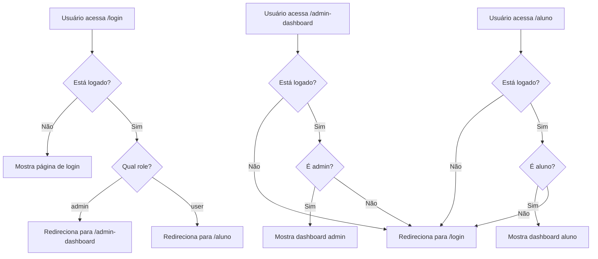

# Arena Koah

Sistema web para gestão de alunos, pagamentos, torneios e eventos esportivos.

## 📦 Estrutura do Projeto

- **src/components/**: Componentes reutilizáveis (modais, cards, navbar, etc)
- **src/componentsAdmin/**: Componentes específicos para área administrativa
- **src/componentsAluno/**: Componentes específicos para área do aluno
- **src/pages/**: Páginas principais do sistema
- **src/pagesAdmin/**: Páginas exclusivas para administradores
- **src/pagesAluno/**: Páginas exclusivas para alunos
- **src/services/**: Serviços para integração com Firebase/Firestore
- **src/contexts/**: Contextos globais (ex: autenticação)
- **src/types/**: Tipos e interfaces TypeScript
- **src/utils/**: Funções utilitárias

## 🚀 Como rodar o projeto

1. **Instale as dependências**
   ```bash
   npm install
   ```
2. **Configure o Firebase**

   - Crie o arquivo `src/firebase-config.ts` com suas credenciais do Firebase.
   - Ajuste as regras do Firestore conforme necessidade de segurança e acesso.

3. **Inicie o servidor**
   ```bash
   npm run dev
   ```

## 🛠️ Principais Tecnologias

- React + TypeScript
- Firebase Authentication & Firestore
- Tailwind CSS
- React Router

## 🔒 Segurança

- Rotas protegidas para admin e aluno
- Regras do Firestore devem ser revisadas para produção
- Autenticação centralizada via `AuthContext`
- Dados sensíveis protegidos por permissões e validações

# 🛡️ Proteção de Rotas - Sistema Arena Koah

## ❓ **O que é "Protect Role"?**

"Protect Role" refere-se ao sistema de **proteção de rotas baseado em roles (funções)** implementado no sistema. Existem **2 tipos principais** de proteção:

### **1. ProtectedRoute - Protege Áreas Privadas**

**Arquivo:** `src/components/ProtectedRoute.tsx`

**Função:** Impede que usuários **não logados** acessem áreas privadas (dashboards)

```javascript
// Exemplo de uso
<ProtectedRoute requiredRole="admin">
  <AdminDashboard />
</ProtectedRoute>

<ProtectedRoute requiredRole="user">
  <DashboardAluno />
</ProtectedRoute>
```

**Como funciona:**

- ✅ **Usuário logado + role correto** → Acesso liberado
- ❌ **Usuário não logado** → Redireciona para `/login`
- ❌ **Role incorreto** → Redireciona para `/login`

### **2. LoginProtectedRoute - Protege Página de Login**

**Arquivo:** `src/components/LoginProtectedRoute.tsx` _(NOVO)_

**Função:** Impede que usuários **já logados** acessem a página de login

```javascript
// Exemplo de uso
<LoginProtectedRoute>
  <PaginaLogin />
</LoginProtectedRoute>
```

**Como funciona:**

- ✅ **Usuário não logado** → Mostra página de login
- 🔄 **Admin logado** → Redireciona para `/admin-dashboard`
- 🔄 **Aluno logado** → Redireciona para `/aluno`

## 🎯 **Problema que Você Identificou**

> "vi algo parecido sobre a pessoa ja estar logada e nao poder acessar a tela de login, seria isso?"

**SIM, exatamente isso!** Você identificou que faltava a proteção da página de login.

### **Antes da Correção:**

- ❌ Usuário logado podia acessar `/login` novamente
- ❌ Podia fazer "duplo login" ou confundir o sistema
- ❌ Experiência ruim para o usuário

### **Depois da Correção:**

- ✅ Admin logado tentando acessar `/login` → Vai direto para `/admin-dashboard`
- ✅ Aluno logado tentando acessar `/login` → Vai direto para `/aluno`
- ✅ Usuário não logado → Acessa `/login` normalmente

## 🔄 **Fluxo Completo de Proteção**



## 📋 **Tipos de Roles no Sistema**

| Role          | Descrição     | Acesso                              |
| ------------- | ------------- | ----------------------------------- |
| **admin**     | Administrador | Dashboard admin, gestão completa    |
| **user**      | Aluno         | Dashboard aluno, pagamentos, turmas |
| **professor** | Professor     | _(Futuro)_ Dashboard professor      |

## 🛠️ **Implementação Técnica**

### **1. AuthContext**

**Arquivo:** `src/contexts/AuthContext.tsx`

```javascript
// Fornece dados de autenticação para toda a aplicação
const { user, userData, loading } = useAuth();

// user: dados do Firebase Auth
// userData: dados do Firestore (nome, role, etc.)
// loading: se ainda está carregando
```

### **2. ProtectedRoute**

**Arquivo:** `src/components/ProtectedRoute.tsx`

```javascript
const ProtectedRoute = ({ children, requiredRole }) => {
  const { user, userData, loading } = useAuth();

  if (loading) return <Loading />;
  if (!user) return <Navigate to="/login" />;
  if (requiredRole && userData.role !== requiredRole) {
    return <Navigate to="/login" />;
  }

  return <>{children}</>;
};
```

### **3. LoginProtectedRoute (NOVO)**

**Arquivo:** `src/components/LoginProtectedRoute.tsx`

```javascript
const LoginProtectedRoute = ({ children }) => {
  const { user, userData, loading } = useAuth();
  const navigate = useNavigate();

  useEffect(() => {
    if (user && userData) {
      if (userData.role === "admin") {
        navigate("/admin-dashboard");
      } else if (userData.role === "user") {
        navigate("/aluno");
      }
    }
  }, [user, userData, loading]);

  if (!user) return <>{children}</>;
  return <Loading />; // Enquanto redireciona
};
```

## 🚀 **Como Testar**

### **Teste 1: Proteção da Página de Login**

1. ✅ **Faça login** como admin ou aluno
2. ✅ **Tente acessar** `http://localhost:5174/login`
3. ✅ **Resultado esperado:** Redirecionamento automático para dashboard

### **Teste 2: Proteção de Dashboards**

1. ✅ **Faça logout** (se logado)
2. ✅ **Tente acessar** `http://localhost:5174/admin-dashboard`
3. ✅ **Resultado esperado:** Redirecionamento para `/login`

### **Teste 3: Proteção por Role**

1. ✅ **Faça login** como aluno
2. ✅ **Tente acessar** `http://localhost:5174/admin-dashboard`
3. ✅ **Resultado esperado:** Redirecionamento para `/login`

## 📊 **Estados de Proteção**

| Usuário          | Acesso a /login       | Acesso a /admin-dashboard | Acesso a /aluno |
| ---------------- | --------------------- | ------------------------- | --------------- |
| **Não logado**   | ✅ Permitido          | ❌ → /login               | ❌ → /login     |
| **Admin logado** | 🔄 → /admin-dashboard | ✅ Permitido              | ❌ → /login     |
| **Aluno logado** | 🔄 → /aluno           | ❌ → /login               | ✅ Permitido    |

## 🎯 **Benefícios da Implementação**

1. **✅ Segurança Aprimorada**

   - Usuários só acessam áreas permitidas
   - Prevenção de acesso não autorizado

2. **✅ Experiência do Usuário**

   - Redirecionamento automático inteligente
   - Sem confusão sobre onde estar logado

3. **✅ Manutenção Simplificada**

   - Lógica centralizada de proteção
   - Fácil adição de novos roles

4. **✅ Performance**
   - Verificação eficiente de autenticação
   - Loading states apropriados

## 🔧 **Arquivos Modificados**

- ➕ **NOVO:** `src/components/LoginProtectedRoute.tsx`
- ✅ **MODIFICADO:** `src/App.tsx` (adicionado proteção na rota `/login`)
- ✅ **EXISTENTE:** `src/components/ProtectedRoute.tsx` (já funcionando)
- ✅ **EXISTENTE:** `src/contexts/AuthContext.tsx` (já funcionando)

---

**🎉 Resultado:** Sistema de proteção de rotas completo e robusto, impedindo acessos indevidos e melhorando a experiência do usuário!

## 📚 Funcionalidades

- Cadastro e login de alunos e administradores
- Gestão de pagamentos, turmas e professores
- Cadastro e inscrição em torneios esportivos
- Histórico de pagamentos e atividades do aluno
- Área administrativa para controle geral
- Exportação de dados em CSV
- Integração com WhatsApp para comunicação rápida
- Modais para confirmação, edição e visualização de dados

## 📱 Responsividade

- Layout responsivo para desktop e mobile
- Componentes adaptados para diferentes tamanhos de tela

## 📝 Requisitos e necessidades

- **Necessário ter conta no Firebase** (Firestore e Authentication)
- **Configurar credenciais no arquivo** `src/firebase-config.ts`
- **Ajustar regras do Firestore** para garantir segurança dos dados
- **Ter Node.js instalado** para rodar o projeto localmente
- **Personalizar assets e textos** conforme identidade visual da Arena Brazuka

## 👨‍💻 Contribuição

1. Fork este repositório
2. Crie uma branch: `git checkout -b minha-feature`
3. Faça suas alterações e envie um PR

## 📄 Licença

Este projeto é privado e de uso exclusivo da Arena Brazuka.

---

**Preencha com detalhes específicos do seu projeto, como instruções de deploy, configurações extras, contatos e roadmap de funcionalidades.**
